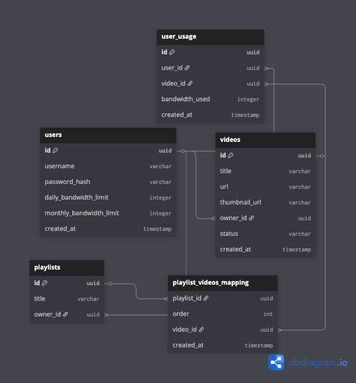

# DB Design For The Project

## DBDiagram.io Structure



```dbml
Table users {
  id uuid [primary key]
  username varchar
  password_hash varchar
  daily_bandwidth_limit integer
  monthly_bandwidth_limit integer
  created_at timestamp
}

Table user_usage {
  id uuid [primary key]
  user_id uuid
  video_id uuid
  bandwidth_used integer
  created_at timestamp
}

Table videos {
  id uuid [primary key]
  title varchar
  url varchar
  thumbnail_url varchar
  owner_id uuid
  status varchar
  created_at timestamp
}

Table playlists {
  id uuid [primary key]
  title varchar
  owner_id uuid
}

Table playlist_videos_mapping {
  playlist_id uuid
  position int
  video_id uuid
  created_at timestamp
}


Ref: "users"."id" < "videos"."owner_id"

Ref: "users"."id" < "playlists"."owner_id"

Ref: "videos"."id" < "playlist_videos_mapping"."video_id"

Ref: "playlists"."id" < "playlist_videos_mapping"."playlist_id"

Ref: "users"."id" < "user_usage"."user_id"

Ref: "videos"."id" < "user_usage"."video_id"
```

## Purpose

* Manage Users so Others can test and I can keep watching my personal videos ( I want ).
* Easy way to organize videos and stuff.
* Can manage bandwidth for others I will have unlimited.