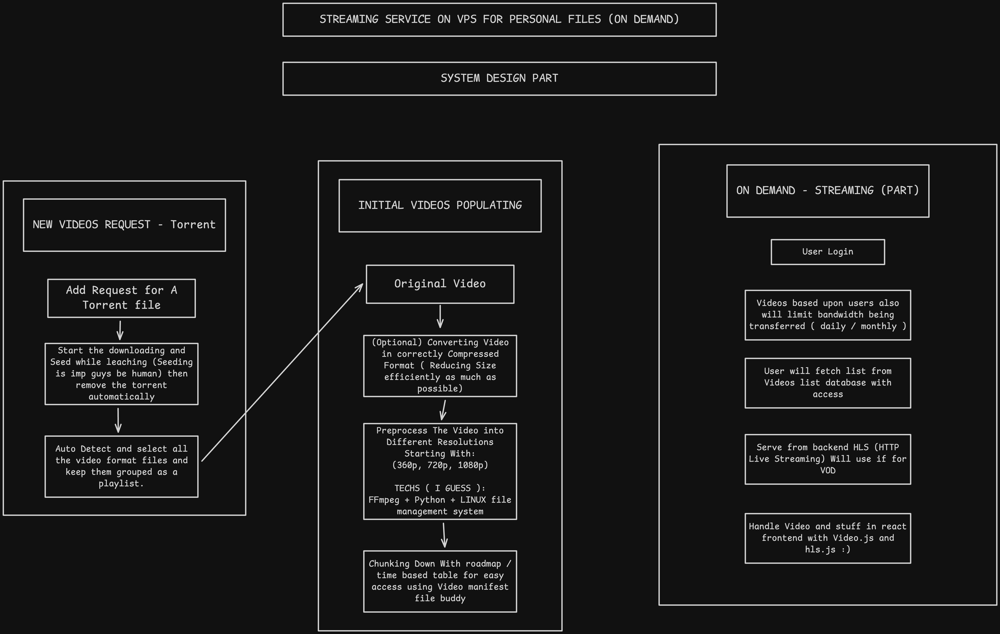

# System Design

## Image Checkout the design ;)

## Storage Part
* Going to use local VPS storage in this structure:
BASE_URL
 └── users/
     └── 123/
         └── videos/
             └── 456/
                 ├── master.m3u8
                 ├── 360p.mp4
                 └── thumbnail.jpg

## Basic Explaination

* Just building so I can learn System design better
* Will be using FastAPI, React and FFMpeg for all the functioning
* Will add Torrent downloading as well